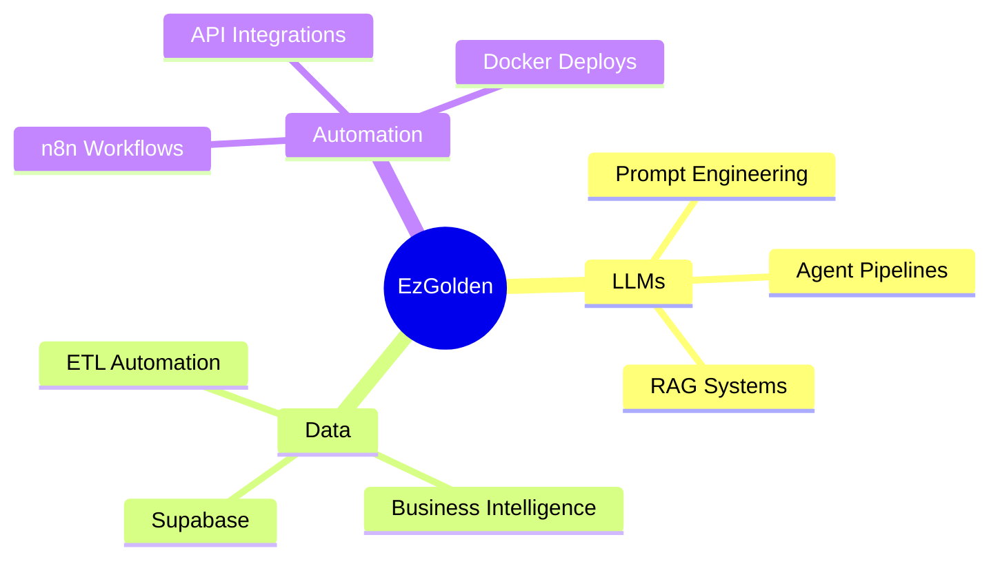

<div align="center">

```
╔═══════════════════════════════════════════════════════════════╗
║                                                               ║
║   ██████╗ ███████╗███████╗███████╗ █████╗ ██████╗  ██████╗  ║
║   ██╔══██╗██╔════╝██╔════╝██╔════╝██╔══██╗██╔══██╗██╔════╝  ║
║   ██████╔╝█████╗  ███████╗█████╗  ███████║██████╔╝██║       ║
║   ██╔══██╗██╔══╝  ╚════██║██╔══╝  ██╔══██║██╔══██╗██║       ║
║   ██║  ██║███████╗███████║███████╗██║  ██║██║  ██║╚██████╗  ║
║   ╚═╝  ╚═╝╚══════╝╚══════╝╚══════╝╚═╝  ╚═╝╚═╝  ╚═╝ ╚═════╝  ║
║                                                               ║
╚═══════════════════════════════════════════════════════════════╝
```

</div>

<div align="center">

<!-- Animated typing header -->
[](https://git.io/typing-svg)

</div>

---


### `> whoami`

```python
class EzGolden:
    name        = "Ezgolden"
    role        = "Tech Researcher & Builder"
    location    = "🌎 Brazil"
    focus       = ["LLMs", "Data Dev", "Automation"]
    mindset     = "Always learning, always building"

    def current_mission(self):
        return "Turn ideas into intelligent systems"
```

<br clear="right"/>

---

## ⚡ What I'm working on

```bash
$ ls -la ./projects/

drwxr-xr-x  LLM integrations & AI pipelines
drwxr-xr-x  Data automation workflows
drwxr-xr-x  Business intelligence systems
drwxr-xr-x  No-code / low-code tools
```

---

## 🛠️ Tech Stack

<div align="center">

| Layer | Tools |
|---|---|
| **Data** |    |
| **Frontend** |    |
| **Automation** |   |
| **Backend** |  |

</div>

---

## 📊 GitHub Stats

<div align="center">
  
  
</div>

<div align="center">
  
</div>

<div align="center">
  
</div>

---

## 🧠 Current Focus



---

<div align="center">

### `"The best code is the one that solves real problems."`


</div>
